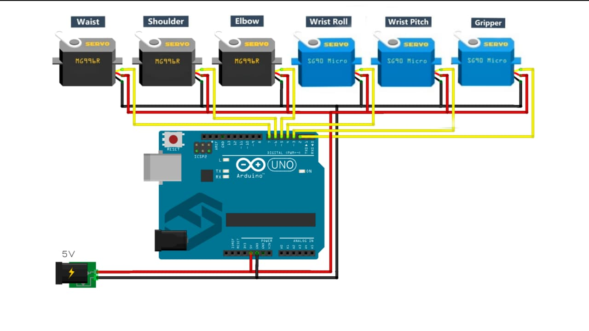
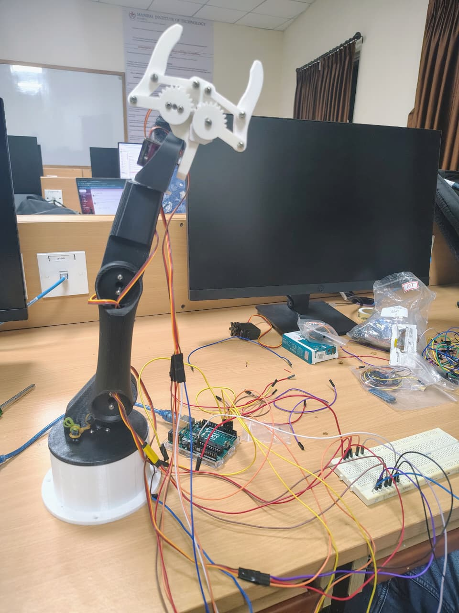

# 6-DOF-robotic-arm

## Overview

This project is a 6-DOF robotic arm developed using Arduino Uno and servo motors to achieve multi-joint motion control and pick-and-place functionality.

## Features

* Control of six independent joints
* PWM-based servo control for smooth and precise motion
* UART communication for real-time PC control
* Position save, playback, and reset functionality
* Suitable for pick-and-place operations

## Components Used

* Arduino Uno
* MG996R Servo Motors (high torque joints)
* SG90 Servo Motors (wrist and gripper)
* External 5–6V power supply

## Working Principle

The robotic arm is controlled using PWM signals to drive servo motors. Each joint receives angle commands from Arduino, enabling coordinated motion. UART communication allows real-time control from a PC.

## Project Demo

## Applications

* Pick and place automation
* Robotics learning
* Industrial automation concepts
