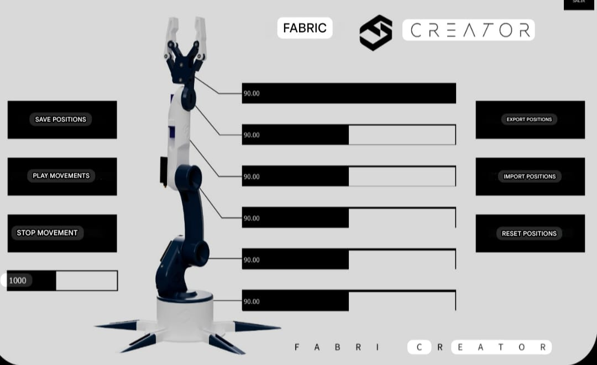

# 6-DOF Robotic Arm

## Overview

This project is a 6-DOF robotic arm developed using Arduino Uno and servo motors to achieve multi-joint motion control and pick-and-place functionality.

## Features

* Control of six independent joints
* PWM-based servo control for smooth and precise motion
* UART communication for real-time PC control
* Position save, playback, and reset functionality
* Suitable for pick-and-place operations

## Components Used

* Arduino Uno
* MG996R Servo Motors (high torque joints)
* SG90 Servo Motors (wrist and gripper)
* External 5–6V power supply

## Working Principle

The robotic arm is controlled using PWM signals to drive servo motors. Each joint receives angle commands from Arduino, enabling coordinated motion. UART communication allows real-time control from a PC.

## How to Run

1. Upload the Arduino code to Arduino Uno
2. Connect servo motors to pins 2–8
3. Use external 5–6V power supply for servos
4. Open Serial Monitor (9600 baud rate)
5. Send commands in format: `1:90`
6. Observe robotic arm movement

## Code Explanation

* Uses Servo library to control multiple joints
* Each servo is connected to a specific Arduino pin
* Serial communication is used to receive commands from PC
* Input format: `servoIndex:angle`
* Switch-case logic controls individual servo movement
* Mirror logic used for coordinated motion in one joint

## Project Demo

## Software Control Interface

The robotic arm can be controlled using a PC-based graphical user interface (GUI).

### Features:

* Real-time control of all six joints using sliders
* Save and playback of positions
* Reset and stop movement functionality
* Import and export of motion sequences

The GUI communicates with Arduino using UART (Serial Communication), enabling precise and flexible control of the robotic arm.

## Applications

* Pick and place automation
* Robotics learning
* Industrial automation concepts
